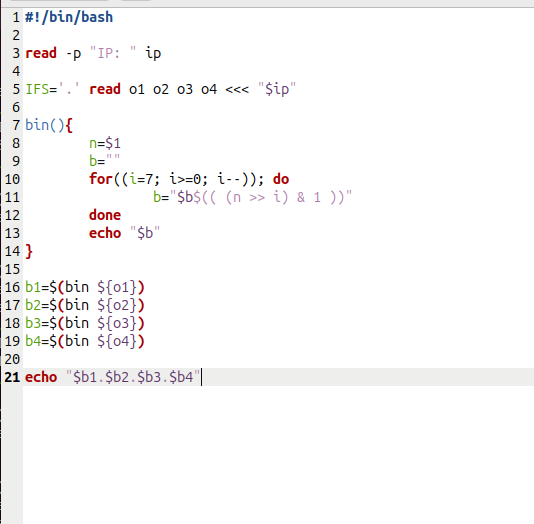
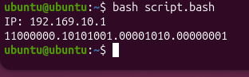

Выполнил Попилев Александр

# Отчет

Пропустим часть с тренировкой и сразу приступим к заданию. Нам нужно сделать такой файл `bash`, который будет принимать на входе ipv4 адрес (примем условность, что он будет верным всегда, то есть каждый октет не больше 255 и всего их 4 штуки через точку)

- сначала читаем строку
- создаем четыре переменные и вносим в каждую октеты: o1 = 192, o2 = 168 и тд
- создаем функцию, которая с помощью цикла и побитовых операций (сдвиг и &), на один o1 выдает его двоичный вид
- создаем четыре итоговые переменные в которые вписываем результат функции bin(o1) и тд
- в конце выводим каждую их них через точки

Теперь проверим работу

Видим как все работает, лабораторная выполнена.
